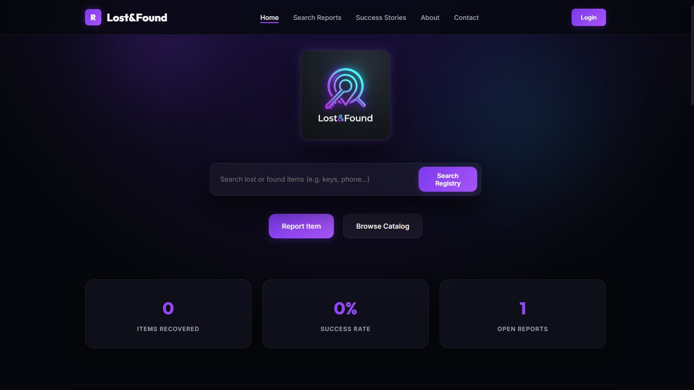

````markdown
# 🔍 ReUnite: Serverless Lost & Found Management Platform




ReUnite is an enterprise-grade, cloud-native Lost & Found management platform built on AWS infrastructure. The application features a modern glassmorphic interface that enables users to securely report lost or found items, upload images, discover potential matches, and manage recovery requests through a scalable serverless backend powered by AWS Lambda, API Gateway, Amazon S3, and Amazon DynamoDB.

---

# 🏗️ Architecture Blueprint

The platform follows a highly available, event-driven architecture designed for secure item management, automatic scaling, and minimal operational overhead.

```
                    ┌─────────────────────┐
                    │     User Browser    │
                    └──────────┬──────────┘
                               │
                     Report Lost / Found Item
                               │
                               ▼
                    ┌─────────────────────┐
                    │    Flask Frontend   │
                    └──────────┬──────────┘
                               │
                  Upload Images & Submit Form
                               │
                ┌──────────────┴──────────────┐
                │                             │
                ▼                             ▼
          Amazon API Gateway             Amazon S3
                │                     Item Image Storage
                ▼
         AWS Lambda Functions
                │
        ┌───────┴────────┐
        │                │
        ▼                ▼
 Amazon DynamoDB    Matching Engine
 Item Database      Search & Recovery
```

### **Presentation Layer**

A responsive Flask web application designed with a premium glassmorphism UI featuring frosted cards, smooth animations, responsive dashboards, drag-and-drop image uploads, and intuitive navigation for reporting and tracking items.

### **Storage Layer**

Images associated with lost and found items are securely stored in Amazon S3, ensuring durable, scalable, and highly available object storage.

### **Compute Layer**

AWS Lambda processes incoming requests from API Gateway, validates user submissions, performs item matching, generates secure recovery identifiers, and communicates with DynamoDB.

### **Matching Engine**

A lightweight keyword-based similarity engine analyzes item titles and descriptions to identify potential matches between lost and found reports, helping users recover belongings more efficiently.

### **Persistence Layer**

Amazon DynamoDB stores structured information including user reports, item details, recovery requests, timestamps, and status updates while supporting high-speed, serverless access.

---

# 🛠️ Infrastructure Component Breakdown

| AWS Service | Functional Role |
| :--- | :--- |
| **AWS Lambda** | Executes serverless business logic for reporting, searching, and recovery workflows. |
| **Amazon API Gateway** | Provides secure REST endpoints connecting the frontend with Lambda functions. |
| **Amazon S3** | Stores uploaded images for lost and found items. |
| **Amazon DynamoDB** | Maintains item records, recovery status, user submissions, and search history. |
| **AWS IAM** | Implements secure least-privilege access between AWS services. |
| **Amazon CloudWatch** | Captures execution logs, request metrics, and application monitoring data. |

---

# 💻 Technical Design Highlights

## Intelligent Item Matching

The matching engine compares keywords extracted from lost and found reports to determine potential ownership matches while reducing duplicate entries.

### Similarity Evaluation

Candidate matches are ranked according to keyword similarity.

```text
Shared Keywords ≥ Matching Threshold
          │
          ├────────► Potential Match
          │
Shared Keywords < Threshold
          │
          └────────► No Match Found
```

---

## Secure Recovery Workflow

Every reported item is assigned a unique recovery identifier that can be verified during handoff.

Each successful recovery record stores:

- Recovery ID
- Item Details
- Owner Information
- Finder Information
- Recovery Timestamp
- Current Status

The platform also supports QR-based verification and anonymous contact requests to protect user privacy throughout the recovery process.

---

# 🚀 Step-by-Step Deployment Guide

## 1. Create Python Virtual Environment

```bash
python -m venv .venv
```

Activate the environment.

### Windows

```powershell
.venv\Scripts\Activate.ps1
```

### Linux / macOS

```bash
source .venv/bin/activate
```

---

## 2. Install Dependencies

```bash
pip install -r requirements.txt
```

---

## 3. Configure AWS Credentials

```bash
aws configure
```

Provide:

```text
AWS Access Key ID
AWS Secret Access Key
Region: ap-south-1
Output Format: json
```

If AWS credentials are unavailable, the application automatically switches to SQLite local development mode.

---

## 4. Create AWS Resources

Provision the following services:

- Amazon S3 Bucket
- Amazon DynamoDB Table
- AWS Lambda Functions
- Amazon API Gateway
- IAM Roles & Policies
- Amazon CloudWatch

---

## 5. Run Flask Application

```bash
python app.py
```

Open your browser:

```
http://127.0.0.1:5000
```

Report lost or found items, upload images, search for matching belongings, and manage recovery requests through the dashboard.

---

# 📈 Learning Outcomes

This project demonstrates practical experience with:

- Serverless cloud application architecture
- AWS Lambda event-driven computing
- RESTful API development with API Gateway
- Amazon S3 object storage
- Amazon DynamoDB NoSQL database design
- Flask full-stack web application development
- Secure IAM role and policy management
- Cloud monitoring using Amazon CloudWatch
- Image upload and asset lifecycle management
- Serverless workflow integration across AWS services

---

# 👨‍💻 Technologies Used

- Python 3.12
- Flask
- Boto3
- AWS Lambda
- Amazon API Gateway
- Amazon DynamoDB
- Amazon S3
- Amazon CloudWatch
- SQLite (Local Development)
- HTML5
- CSS3
- JavaScript

---

# 👤 Author

**Ayush Chaudhari**

Cloud Computing • Python Developer • AWS Enthusiast

---

# 📄 License

This project is developed for educational and portfolio purposes and showcases the implementation of a scalable serverless Lost & Found platform using Amazon Web Services.
````
